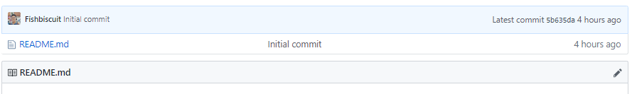
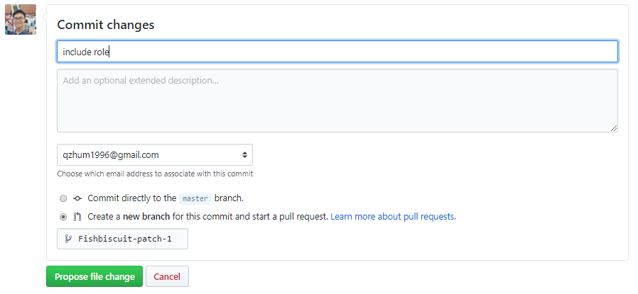
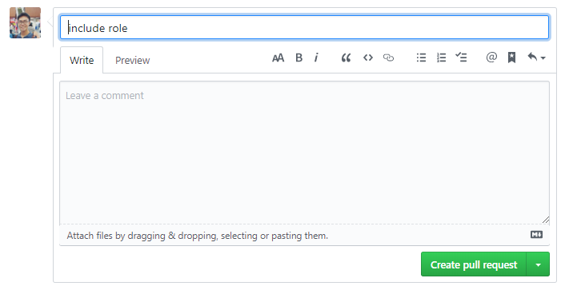
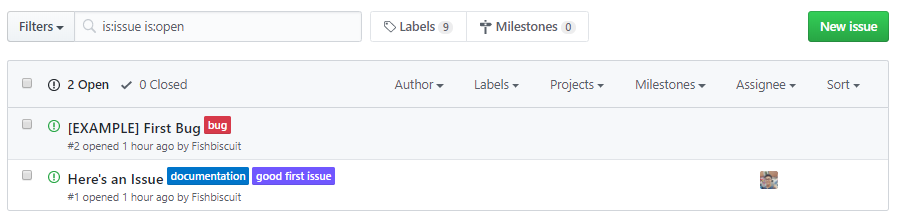
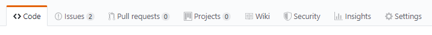

# serveSG-onboarding
## 1 Making Edits to documents
Task: Add your name by editing the readme into the team you'd like to be a part of using this

This is how we make edits to documents on Github.

**a Click on the pencil button**

**b Make your edit, create a new branch and propose a file change**

**b Create a Pull Request**

## 2 Creating an Issue
Task: Make your first issue in your own repository

This is how one communicates bugs, suggest improvements, and track work on Github.

**a Report an Issue**

**b Choose a template or make your own**

**c Fill it up through an issue template or just a regular issue**

hilda

